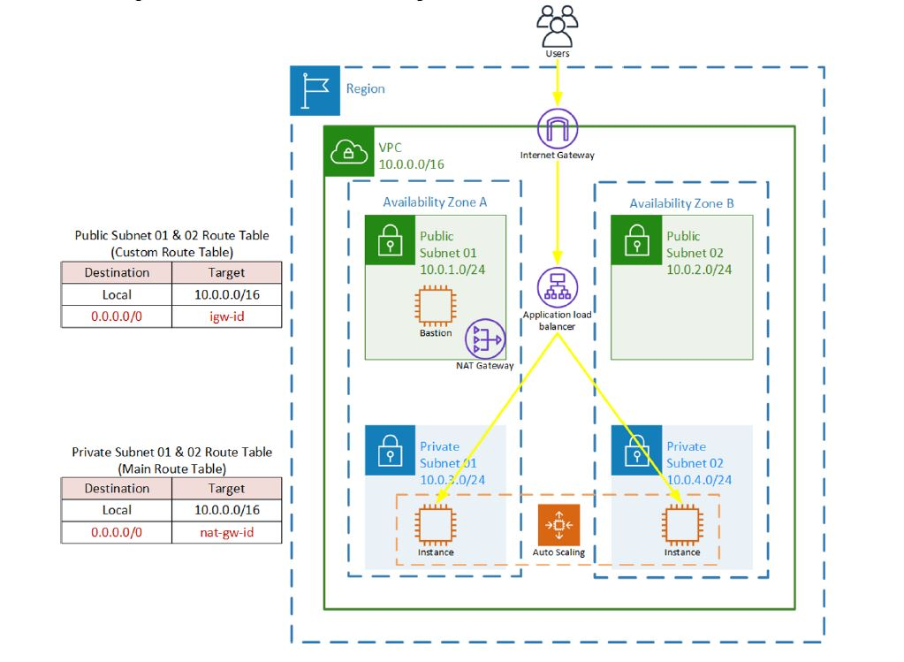

## Infrastructure

This repository contains the building blocks for the infrastructure below.

## Requirements

| Name | Version |
|------|---------|
|  [aws](#requirement\_aws) | ~> 3.0 |

## Providers

| Name | Version |
|------|---------|
|  [aws](#provider\_aws) | 3.63.0 |

## Modules

No modules.

## Resources

| Name | Type |
|------|------|
| [aws_autoscaling_attachment.asg_attachment_elb](https://registry.terraform.io/providers/hashicorp/aws/latest/docs/resources/autoscaling_attachment) | resource |
| [aws_autoscaling_group.asg](https://registry.terraform.io/providers/hashicorp/aws/latest/docs/resources/autoscaling_group) | resource |
| [aws_default_security_group.default](https://registry.terraform.io/providers/hashicorp/aws/latest/docs/resources/default_security_group) | resource |
| [aws_eip.elp](https://registry.terraform.io/providers/hashicorp/aws/latest/docs/resources/eip) | resource |
| [aws_instance.jumpbox](https://registry.terraform.io/providers/hashicorp/aws/latest/docs/resources/instance) | resource |
| [aws_internet_gateway.igw](https://registry.terraform.io/providers/hashicorp/aws/latest/docs/resources/internet_gateway) | resource |
| [aws_launch_configuration.be-as-conf](https://registry.terraform.io/providers/hashicorp/aws/latest/docs/resources/launch_configuration) | resource |
| [aws_lb.be-elb](https://registry.terraform.io/providers/hashicorp/aws/latest/docs/resources/lb) | resource |
| [aws_lb_listener.front_end](https://registry.terraform.io/providers/hashicorp/aws/latest/docs/resources/lb_listener) | resource |
| [aws_lb_target_group.lbtg](https://registry.terraform.io/providers/hashicorp/aws/latest/docs/resources/lb_target_group) | resource |
| [aws_main_route_table_association.a](https://registry.terraform.io/providers/hashicorp/aws/latest/docs/resources/main_route_table_association) | resource |
| [aws_nat_gateway.nat-gateway](https://registry.terraform.io/providers/hashicorp/aws/latest/docs/resources/nat_gateway) | resource |
| [aws_route_table.custom-rt](https://registry.terraform.io/providers/hashicorp/aws/latest/docs/resources/route_table) | resource |
| [aws_route_table.main-rt](https://registry.terraform.io/providers/hashicorp/aws/latest/docs/resources/route_table) | resource |
| [aws_route_table_association.pb1](https://registry.terraform.io/providers/hashicorp/aws/latest/docs/resources/route_table_association) | resource |
| [aws_route_table_association.pb2](https://registry.terraform.io/providers/hashicorp/aws/latest/docs/resources/route_table_association) | resource |
| [aws_route_table_association.prv1](https://registry.terraform.io/providers/hashicorp/aws/latest/docs/resources/route_table_association) | resource |
| [aws_route_table_association.prv2](https://registry.terraform.io/providers/hashicorp/aws/latest/docs/resources/route_table_association) | resource |
| [aws_security_group.allow_http](https://registry.terraform.io/providers/hashicorp/aws/latest/docs/resources/security_group) | resource |
| [aws_subnet.pb-subnet-1](https://registry.terraform.io/providers/hashicorp/aws/latest/docs/resources/subnet) | resource |
| [aws_subnet.pb-subnet-2](https://registry.terraform.io/providers/hashicorp/aws/latest/docs/resources/subnet) | resource |
| [aws_subnet.prv-subnet-1](https://registry.terraform.io/providers/hashicorp/aws/latest/docs/resources/subnet) | resource |
| [aws_subnet.prv-subnet-2](https://registry.terraform.io/providers/hashicorp/aws/latest/docs/resources/subnet) | resource |
| [aws_vpc.main](https://registry.terraform.io/providers/hashicorp/aws/latest/docs/resources/vpc) | resource |
| [aws_ami.amazon_linux](https://registry.terraform.io/providers/hashicorp/aws/latest/docs/data-sources/ami) | data source |
| [aws_availability_zones.available](https://registry.terraform.io/providers/hashicorp/aws/latest/docs/data-sources/availability_zones) | data source |
| [aws_instance.asg-instances](https://registry.terraform.io/providers/hashicorp/aws/latest/docs/data-sources/instance) | data source |
| [aws_instances.nodes](https://registry.terraform.io/providers/hashicorp/aws/latest/docs/data-sources/instances) | data source |

## Inputs

| Name | Description | Type | Default | Required |
|------|-------------|------|---------|:--------:|
|  [asg-des](#input\_asg-des) | n/a | `number` | `2` | no |
|  [asg-max](#input\_asg-max) | n/a | `number` | `2` | no |
|  [asg-min](#input\_asg-min) | n/a | `number` | `2` | no |
|  [ec2-instance-type](#input\_ec2-instance-type) | EC2 instance type | `string` | `"t3.micro"` | no |
|  [private-subnet-ip](#input\_private-subnet-ip) | n/a | `list(any)` | <pre>[   "10.0.3.0/24",   "10.0.4.0/24" ]</pre> | no |
|  [public-key-name](#input\_public-key-name) | n/a | `string` | `"tekup-user"` | no |
|  [public-subnet-ip](#input\_public-subnet-ip) | n/a | `list(any)` | <pre>[   "10.0.1.0/24",   "10.0.2.0/24" ]</pre> | no |
|  [region](#input\_region) | AWS Region for the VPC | `string` | `"us-east-1"` | no |
|  [vpc-cidr](#input\_vpc-cidr) | CIDR for the VPC | `string` | `"10.0.0.0/16"` | no |

## Outputs

| Name | Description |
|------|-------------|
|  [aws\_lb](#output\_aws\_lb) | The public DNS of the frontal LoadBalancer |
|  [jumpbox\_ip\_addr](#output\_jumpbox\_ip\_addr) | The public IP address of the main jumpbox instance. |
|  [private-ips](#output\_private-ips) | The private IP addresses of the main jumpbox instance. |
